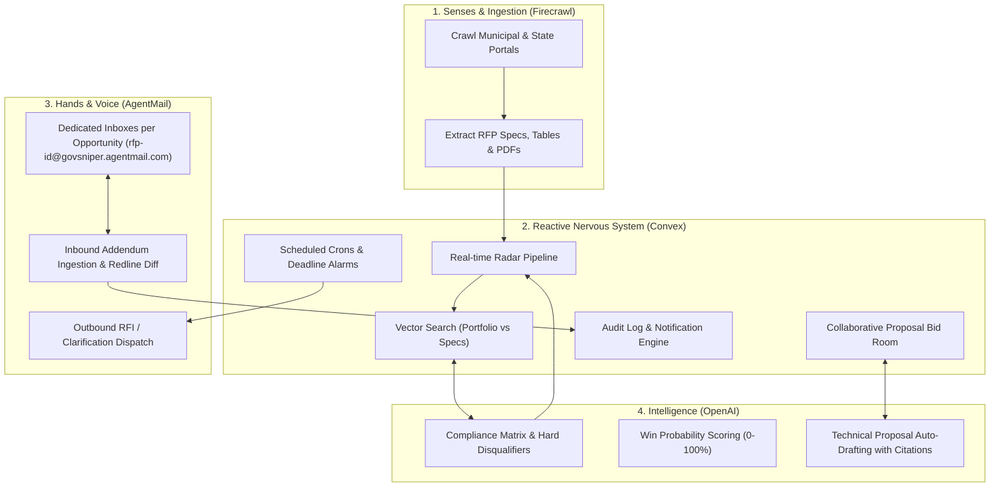

# GovSniper (ProcurePulse) — Autonomous Public & Enterprise Procurement Command Center

> **Submission for Convex "All Gas" Hackathon**  
> Built with **Convex** (Reactive Real-time Backend & Vector DB), **Firecrawl** (Web Ingestion & Scraping), **AgentMail** (Autonomous Dedicated Inboxes & Email Agents), and **OpenAI** (Reasoning & Proposal Generation).

---

## 1. Executive Summary & Problem Statement

Governments, municipalities, and enterprise organizations issue **trillions of dollars** in Requests for Proposals (RFPs), tenders, bids, and grants every year across construction, IT infrastructure, defense, green energy, municipal supplies, and healthcare.

### The Real-World Friction
1. **Scattered & Archaic Portals**: Opportunities are buried across thousands of municipal websites without standardized APIs.
2. **Analysis Paralysis**: Each RFP spec is a 100–300 page complex PDF containing strict legal disqualifiers and technical requirements. Small & medium businesses (SMBs) spend weeks manually vetting requirements.
3. **Chaotic & High-Stakes Email Communications**: Official clarifications (RFIs), Q&A addendums, and deadline revisions happen strictly via email. Missing a single addendum or clarification deadline leads to instant disqualification.

**GovSniper** solves this by providing a unified **Autonomous Procurement Command Center** that continuously discovers tenders, extracts compliance matrices, assesses win probability, auto-generates cited technical proposals, and manages dedicated email inboxes with contracting officers.

---

## 2. Technology Stack & Integration Architecture

### Component Synergy
* **Convex**:
  * **Reactive Subscriptions (`useQuery`)**: Live radar updates, instant multi-user synchronization without polling or page reloads.
  * **Vector Embeddings & Search**: Evaluates semantic similarity between the company's past win portfolio/certifications and multi-page RFP requirements to calculate a dynamic **Win Probability Score (0–100%)**.
  * **Mutations & Optimistic Updates**: Instant UI responsiveness for triage, tagging, and bid authoring.
  * **Scheduled Actions & Crons**: Automated countdowns for proposal deadlines, daily portal crawl triggers, and scheduled compliance audits.
  * **Presence / Collaboration**: Real-time collaborative drafting in the Bid Room with active cursor indicators.
* **Firecrawl**:
  * Crawls city, county, and state purchasing portals.
  * Downloads and converts multi-page RFP documents and pricing schedules into clean structured Markdown.
* **AgentMail**:
  * Provisions autonomous, dedicated email addresses for every tracked tender (e.g. `rfp-austin-grid-44@govsniper.agentmail.com`).
  * **Inbound**: Listens for addendums, amendments, and Q&A answers from contracting officers; notifies Convex to trigger re-analysis.
  * **Outbound**: Formats and sends official vendor inquiry letters and clarification requests directly to procurement officers.
* **OpenAI**:
  * Extracts hard compliance rules (*Must-Haves*, *Disqualifiers*, *Bonding Limits*, *Mandatory Certifications*).
  * Auto-drafts complete technical proposals with direct section citations back to the source RFP document.

---

## 3. Data Schema Design (Convex)

### Tables:
1. `vendorProfiles`:
   * `name`, `industry`, `capabilities`, `certifications` (ISO, SOC2, bonding limits), `pastPerformance` (array of case studies), `vectorEmbedding`.
2. `tenders` (Opportunities):
   * `title`, `agency`, `category`, `budget`, `status` (`discovered`, `analyzing`, `bidding`, `submitted`, `won`, `lost`), `sourceUrl`, `deadline`, `scrapedAt`.
   * `specsMarkdown`, `summary`, `vectorEmbedding`.
   * `winScore` (0–100), `riskLevel` (`low`, `medium`, `high`).
   * `assignedAgentEmail` (e.g., `rfp-xyz@govsniper.agentmail.com`).
3. `complianceChecks`:
   * `tenderId`, `category` (Legal, Technical, Financial, Insurance), `requirementText`, `status` (`passed`, `warning`, `disqualified`), `citation`, `notes`.
4. `proposals`:
   * `tenderId`, `version`, `title`, `executiveSummary`, `technicalApproach`, `pricingStrategy`, `teamQualifications`, `liveContent`, `lastEditedBy`.
5. `emailThreads` & `emailMessages`:
   * `tenderId`, `agentEmail`, `officerEmail`, `officerName`, `subject`, `direction` (`inbound` / `outbound`), `bodyHtml`, `bodyText`, `hasAttachments`, `receivedAt`.
6. `auditLogs`:
   * `tenderId`, `actionType` (`crawl_discovered`, `analysis_complete`, `addendum_received`, `email_sent`, `bid_drafted`), `timestamp`, `details`.

---

## 4. High-Impact UI / UX Specification

### Aesthetic Direction: Dark-Mode High-Tech "Mission Control"
* **Palette**: Deep void tones (`#0a0d14`), obsidian card surfaces (`#111726`), electric cyan accents (`#00f0ff`), cyber amber warnings (`#f59e0b`), emerald win indicators (`#10b981`).
* **Typography**: Clean, high-legibility geometric sans for metadata paired with monospaced accents for figures, dates, and status codes.

### Key Layout Views:
1. **Radar Discovery Center**:
   * Live streaming feed of recently crawled tenders with active pulse indicators.
   * Quick filter by budget size, geography, and win-probability tier.
2. **Tender War Room**:
   * **Win Probability Gauge**: Radial circular visualizer detailing overall fit.
   * **Compliance Matrix Grid**: Interactive checklist classifying all hard and soft requirements.
   * **Source Document Inspector**: Side-by-side view with highlighting of extracted requirements.
3. **Autonomous AgentMail Hub**:
   * Dedicated email conversation pane connected to the contracting officer.
   * One-click "Draft Clarification Question" powered by AI.
   * Real-time notification badge on new inbound addendum emails.
4. **Collaborative Bid Studio**:
   * Rich-text collaborative proposal editor with real-time cursor presence.
   * AI sidebar with "Generate Compliance Section", "Cite Past Project Experience", and "Export Bid Package (PDF)".
5. **✨ Live Simulation & Judge Testing Mode**:
   * A prominent top-bar button for hackathon judges that initiates an end-to-end interactive demo in under 15 seconds (simulates a live crawl &rarr; analyzes document &rarr; computes win probability &rarr; generates proposal &rarr; receives inbound test email via AgentMail).

---

## 5. Judge Presentation & 3-Minute Demo Video Blueprint

* **0:00 – 0:30 (The Problem)**: The pain of $13T in government procurement lost to manual RFP review and missed addendums.
* **0:30 – 1:30 (The Live Workflow)**:
  1. Show Firecrawl actively streaming in new city tenders.
  2. Open an opportunity: Convex calculates 92% win probability and extracts a 14-point compliance matrix via OpenAI.
  3. Show the dedicated AgentMail inbox: incoming addendum email arrives live, Convex updates the requirement checklist reactively.
  4. Generate and collaboratively edit the proposal in the Bid Studio.
* **1:30 – 2:30 (Architecture & Convex Power)**:
  * Highlight Convex's real-time queries, vector search over vendor capabilities, scheduled deadline crons, and zero-latency mutations.
* **2:30 – 3:00 (Impact & Wrap-Up)**:
  * Summary of real-world value for businesses, call to action to test live at `convex.site`.
