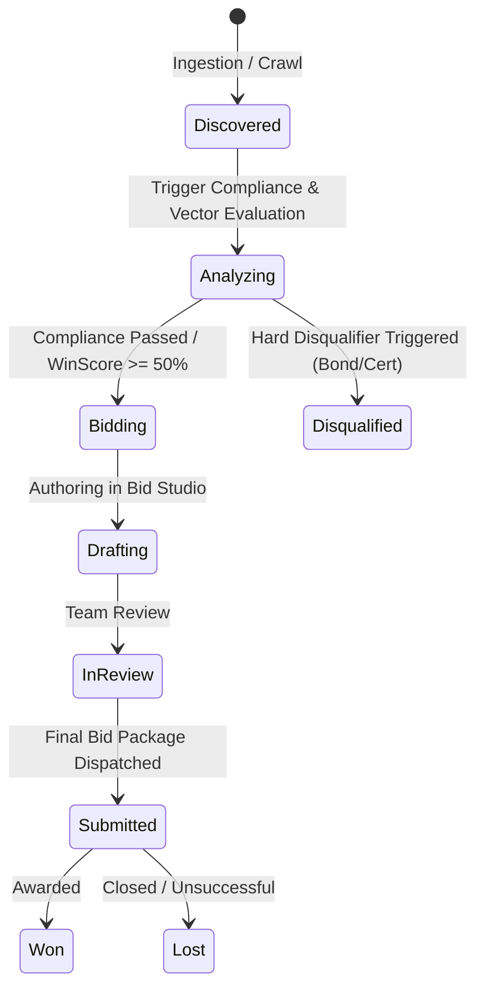

# Data Model & Schema Specification: GovSniper

**Feature**: Autonomous Public & Enterprise Procurement Command Center  
**Branch**: `001-procurement-command-center`  
**Database Runtime**: Convex (`convex/schema.ts`)

---

## 1. Tables & Schemas

### 1.1 `vendorProfiles`
Stores company capabilities, certifications, past project performance, and capability vector embeddings.

| Field | Type | Description |
| :--- | :--- | :--- |
| `_id` | `Id<"vendorProfiles">` | Auto-generated Convex ID |
| `name` | `v.string()` | Company name (e.g., "Apex Cybernetics Corp") |
| `industry` | `v.string()` | Core domain (e.g., "Energy, Cloud Infrastructure, Defense") |
| `capabilities` | `v.array(v.string())` | Key technical capabilities (e.g. `["SCADA Systems", "Smart Grid", "Zero-Trust Architecture"]`) |
| `certifications` | `v.array(v.string())` | Professional certifications (e.g. `["ISO 9001", "ISO 27001", "SOC2 Type II", "NIST 800-53"]`) |
| `bondingLimitUsd` | `v.number()` | Financial surety bonding capacity (e.g., `10000000`) |
| `pastPerformance` | `v.array(v.object({ title: v.string(), client: v.string(), valueUsd: v.number(), year: v.number(), summary: v.string() }))` | Historical contract case studies |
| `capabilityEmbedding` | `v.optional(v.array(v.float64()))` | 1536-dim vector embedding of vendor capabilities |
| `updatedAt` | `v.number()` | Timestamp of last profile update |

**Indexes**:
- Vector index: `by_capability_embedding` on `capabilityEmbedding` (dimensions: 1536, distanceMetric: `"cosine"`)

---

### 1.2 `tenders` (Opportunities)
Represents tracked municipal and enterprise procurement opportunities.

| Field | Type | Description |
| :--- | :--- | :--- |
| `_id` | `Id<"tenders">` | Auto-generated Convex ID |
| `tenderNumber` | `v.string()` | Official RFP identifier (e.g. `RFP-2026-GRID-09`) |
| `title` | `v.string()` | Opportunity title |
| `agency` | `v.string()` | Issuing government agency or enterprise entity |
| `category` | `v.string()` | Sector (e.g., "Energy", "IT & Cloud", "Public Safety", "Infrastructure") |
| `estimatedBudgetUsd` | `v.number()` | Estimated or ceiling contract value in USD |
| `status` | `v.union(v.literal("discovered"), v.literal("analyzing"), v.literal("bidding"), v.literal("submitted"), v.literal("won"), v.literal("lost"))` | Lifecycle stage |
| `sourceUrl` | `v.string()` | Original portal URL |
| `submissionDeadline` | `v.number()` | Unix timestamp of submission deadline |
| `scrapedAt` | `v.number()` | Ingestion timestamp |
| `specsMarkdown` | `v.string()` | Extracted full specification text in Markdown |
| `summary` | `v.string()` | Executive synopsis of scope |
| `winScore` | `v.number()` | Dynamic probability score (0–100) |
| `riskLevel` | `v.union(v.literal("low"), v.literal("medium"), v.literal("high"))` | Risk assessment tier |
| `assignedAgentEmail` | `v.string()` | Dedicated AgentMail address (e.g., `rfp-austin-grid-44@govsniper.agentmail.com`) |
| `officerName` | `v.optional(v.string())` | Contracting officer name |
| `officerEmail` | `v.optional(v.string())` | Contracting officer email |
| `specEmbedding` | `v.optional(v.array(v.float64()))` | 1536-dim vector embedding of RFP specs |

**Indexes**:
- `by_status`: `["status"]`
- `by_deadline`: `["submissionDeadline"]`
- `by_win_score`: `["winScore"]`
- `by_agent_email`: `["assignedAgentEmail"]`
- Vector index: `by_spec_embedding` on `specEmbedding` (dimensions: 1536, distanceMetric: `"cosine"`)

---

### 1.3 `complianceChecks`
Represents individual compliance criteria extracted from RFP specs.

| Field | Type | Description |
| :--- | :--- | :--- |
| `_id` | `Id<"complianceChecks">` | Auto-generated Convex ID |
| `tenderId` | `v.id("tenders")` | Parent opportunity reference |
| `category` | `v.union(v.literal("Legal"), v.literal("Technical"), v.literal("Financial"), v.literal("Insurance"), v.literal("Operational"))` | Requirement domain |
| `requirementText` | `v.string()` | Extracted mandatory requirement |
| `status` | `v.union(v.literal("passed"), v.literal("warning"), v.literal("disqualified"))` | Evaluation outcome |
| `citation` | `v.string()` | Exact section/clause citation (e.g. `Section 4.2.1 (p. 34)`) |
| `notes` | `v.string()` | Diagnostic explanation of pass/warning/disqualify rationale |
| `isDisqualifier` | `v.boolean()` | Flag indicating hard go/no-go requirement |

**Indexes**:
- `by_tender`: `["tenderId"]`
- `by_tender_status`: `["tenderId", "status"]`

---

### 1.4 `proposals`
Represents collaboratively authored bid proposals.

| Field | Type | Description |
| :--- | :--- | :--- |
| `_id` | `Id<"proposals">` | Auto-generated Convex ID |
| `tenderId` | `v.id("tenders")` | Parent opportunity reference |
| `version` | `v.number()` | Proposal revision number |
| `title` | `v.string()` | Proposal document title |
| `executiveSummary` | `v.string()` | Tailored executive pitch |
| `technicalApproach` | `v.string()` | Solution architecture & methodology with citations |
| `pricingStrategy` | `v.string()` | Cost schedule & fee breakdown |
| `teamQualifications` | `v.string()` | Key personnel & past performance references |
| `liveContent` | `v.string()` | Full collaborative Markdown document |
| `lastEditedBy` | `v.string()` | User or agent ID who last modified content |
| `status` | `v.union(v.literal("drafting"), v.literal("in_review"), v.literal("approved"), v.literal("exported"))` | Proposal status |
| `updatedAt` | `v.number()` | Timestamp of last edit |

**Indexes**:
- `by_tender`: `["tenderId"]`

---

### 1.5 `emailThreads` & `emailMessages`
Manages dedicated opportunity email communications.

#### `emailThreads`
| Field | Type | Description |
| :--- | :--- | :--- |
| `_id` | `Id<"emailThreads">` | Auto-generated Convex ID |
| `tenderId` | `v.id("tenders")` | Parent opportunity reference |
| `subject` | `v.string()` | Thread subject line |
| `agentEmail` | `v.string()` | Dedicated opportunity inbox |
| `officerEmail` | `v.string()` | Contracting officer email |
| `officerName` | `v.string()` | Officer name |
| `lastMessageAt` | `v.number()` | Timestamp of most recent activity |

**Indexes**:
- `by_tender`: `["tenderId"]`
- `by_agent_email`: `["agentEmail"]`

#### `emailMessages`
| Field | Type | Description |
| :--- | :--- | :--- |
| `_id` | `Id<"emailMessages">` | Auto-generated Convex ID |
| `threadId` | `v.id("emailThreads")` | Parent thread reference |
| `tenderId` | `v.id("tenders")` | Associated opportunity reference |
| `messageId` | `v.string()` | Unique external email Message-ID (for idempotency) |
| `direction` | `v.union(v.literal("inbound"), v.literal("outbound"))` | Direction |
| `sender` | `v.string()` | Sender email |
| `recipient` | `v.string()` | Recipient email |
| `subject` | `v.string()` | Message subject |
| `bodyText` | `v.string()` | Plain text message body |
| `bodyHtml` | `v.optional(v.string())` | HTML rendered body |
| `isAddendum` | `v.boolean()` | Flag indicating formal addendum / specification change |
| `redlineDiff` | `v.optional(v.string())` | Extracted diff text if addendum changes specifications |
| `createdAt` | `v.number()` | Ingestion timestamp |

**Indexes**:
- `by_thread`: `["threadId"]`
- `by_tender`: `["tenderId"]`
- `by_message_id`: `["messageId"]`

---

### 1.6 `auditLogs`
Immutable trace of all autonomous and human actions.

| Field | Type | Description |
| :--- | :--- | :--- |
| `_id` | `Id<"auditLogs">` | Auto-generated Convex ID |
| `tenderId` | `v.optional(v.id("tenders"))` | Associated opportunity (if applicable) |
| `actionType` | `v.union(v.literal("crawl_discovered"), v.literal("analysis_started"), v.literal("analysis_completed"), v.literal("score_updated"), v.literal("addendum_received"), v.literal("rfi_dispatched"), v.literal("proposal_generated"), v.literal("proposal_edited"), v.literal("simulation_step"))` | Event classification |
| `actor` | `v.string()` | Triggering entity (`"System Agent"`, `"Firecrawl"`, `"OpenAI"`, `"AgentMail"`, `"User"`) |
| `details` | `v.string()` | Human-readable log narrative |
| `metadata` | `v.optional(v.string())` | JSON payload of diagnostic details |
| `timestamp` | `v.number()` | Unix timestamp |

**Indexes**:
- `by_tender`: `["tenderId"]`
- `by_timestamp`: `["timestamp"]`

---

## 2. State Machine: Opportunity Lifecycle

