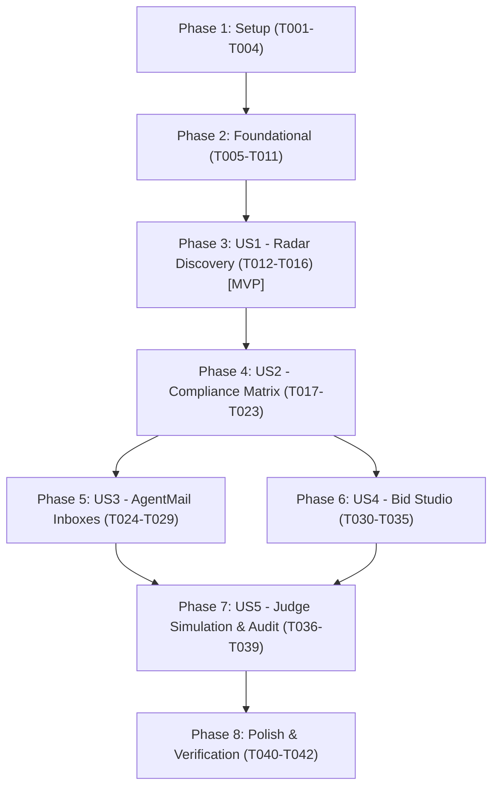

# Tasks: Autonomous Public & Enterprise Procurement Command Center

**Input**: Design documents from `specs/001-procurement-command-center/` (`plan.md`, `spec.md`, `data-model.md`, `contracts/convex-api.md`, `research.md`, `quickstart.md`)  
**Prerequisites**: `plan.md`, `spec.md`, `data-model.md`, `contracts/convex-api.md`, `research.md`  
**Branch**: `main`

---

## Phase 1: Setup (Shared Infrastructure)

**Purpose**: Project initialization, build configuration, and dependency setup

- [X] T001 Initialize project dependencies (React 19, Vite, TypeScript, Convex, TailwindCSS, Lucide) in `package.json`
- [X] T002 [P] Configure Tailwind CSS with Mission Control dark-mode theme (`#0a0d14`, obsidian cards, `#00f0ff` cyan, `#10b981` emerald, `#f59e0b` amber) in `tailwind.config.js` and `src/index.css`
- [X] T003 [P] Configure TypeScript compiler settings and Vite bundler paths in `tsconfig.json`, `tsconfig.node.json`, and `vite.config.ts`
- [X] T004 [P] Configure Convex client environment and settings in `convex/convex.config.ts` and `convex.json`

---

## Phase 2: Foundational (Blocking Prerequisites)

**Purpose**: Core infrastructure, database schemas, vendor profile management, and application layout shell

**⚠️ CRITICAL**: Must complete before user stories can begin

- [ ] T005 Define complete Convex database schema with tables, indexes, and vector indexes in `convex/schema.ts`
- [ ] T006 [P] Define core TypeScript types and domain interfaces in `src/types/index.ts`
- [ ] T007 [P] Create vendor profile management and live vector capability embedding generation in `convex/vendors.ts`
- [ ] T008 [P] Create formatting and calculation utilities (currency, dates, score tiers, citation links) in `src/lib/utils.ts`
- [ ] T009 Implement top-level Convex Client provider and app state routing in `src/main.tsx` and `src/App.tsx`
- [ ] T010 [P] Build Mission Control Header with live Ingestion trigger, Vendor Profile button, and system status in `src/components/layout/Header.tsx`
- [ ] T011 [P] Build Mission Control Sidebar navigation in `src/components/layout/Sidebar.tsx`

**Checkpoint**: Foundation ready — database schema, UI layout shell, and vendor profile system ready.

---

## Phase 3: User Story 1 - Live Tender Discovery & Radar Triage (Priority: P1) 🎯 MVP

**Goal**: Ingest real opportunities dynamically via user-provided portal URLs or documents, standardize, and display live opportunities in the Radar feed with multi-dimensional filtering.

**Independent Test**: User can input a real procurement URL, watch Firecrawl scrape and ingest the RFP live into Convex, apply category/budget filters, and view full RFP details.

### Implementation for User Story 1
- [ ] T012 [P] [US1] Implement Convex queries and mutations for tenders (`listTenders`, `getTenderById`, `createTender`, `updateTenderStatus`, `deleteTender`) in `convex/tenders.ts`
- [ ] T013 [P] [US1] Implement Firecrawl live portal scraping and markdown conversion action in `convex/firecrawl.ts`
- [ ] T014 [US1] Build Radar streaming opportunity card with pulse indicators in `src/components/radar/TenderCard.tsx`
- [ ] T015 [US1] Build multi-dimensional tender filter bar (budget, sector, status, deadline) in `src/components/radar/TenderFilterBar.tsx`
- [ ] T016 [US1] Build interactive RFP Ingestion Modal allowing users to paste any real portal URL or document to trigger live ingestion in `src/components/radar/IngestTenderModal.tsx` and assemble `src/components/radar/RadarFeed.tsx`

**Checkpoint**: User Story 1 complete and independently testable (MVP Milestone).

---

## Phase 4: User Story 2 - Automated Compliance Matrix & Win Probability Scoring (Priority: P2)

**Goal**: Analyze 100+ page RFP specs against vendor profile, extract structured compliance matrix, and calculate win probability (0–100%).

**Independent Test**: User can inspect categorized requirements with pass/warning/disqualify badges and verbatim clause citations.

### Implementation for User Story 2
- [ ] T017 [P] [US2] Implement vendor capability management and profile queries in `convex/vendors.ts`
- [ ] T018 [P] [US2] Implement OpenAI compliance matrix extraction and vector embedding actions in `convex/ai.ts`
- [ ] T019 [P] [US2] Implement compliance check queries and mutations in `convex/compliance.ts`
- [ ] T020 [US2] Build radial Win Probability Gauge visualizer in `src/components/warroom/WinScoreGauge.tsx`
- [ ] T021 [US2] Build interactive Compliance Matrix grid with status badges and citation links in `src/components/warroom/ComplianceGrid.tsx`
- [ ] T022 [US2] Build split-pane RFP Specification Viewer with clause highlighting in `src/components/warroom/SpecViewer.tsx`
- [ ] T023 [US2] Assemble Tender War Room container view in `src/components/warroom/TenderWarRoom.tsx`

**Checkpoint**: User Stories 1 and 2 complete and integrated.

---

## Phase 5: User Story 3 - Autonomous Opportunity Inboxes & Addendum Diffing (Priority: P3)

**Goal**: Provision dedicated email addresses per tender, ingest inbound addendums with redline diff alerts, and draft RFI inquiries.

**Independent Test**: User can view dedicated email hub, receive simulated addendums with redline diff banners, and compose 1-click RFI emails.

### Implementation for User Story 3
- [ ] T024 [P] [US3] Implement email thread and message queries and mutations in `convex/emails.ts`
- [ ] T025 [P] [US3] Implement AgentMail inbox provisioning and outbound dispatch action in `convex/agentmail.ts`
- [ ] T026 [P] [US3] Implement HTTP webhook router for inbound email ingestion and idempotency in `convex/http.ts`
- [ ] T027 [US3] Build Redline Diff alert banner for incoming addendums in `src/components/inboxes/AddendumBanner.tsx`
- [ ] T028 [US3] Build 1-click AI RFI / Clarification email composer modal in `src/components/inboxes/RfiDraftModal.tsx`
- [ ] T029 [US3] Assemble Autonomous AgentMail Hub conversation view in `src/components/inboxes/AgentMailHub.tsx`

**Checkpoint**: User Stories 1, 2, and 3 complete.

---

## Phase 6: User Story 4 - Collaborative Bid Studio & Cited Proposal Drafting (Priority: P4)

**Goal**: Collaborative markdown proposal authoring with AI generation of cited sections and real-time presence.

**Independent Test**: User can auto-draft proposals with inline RFP citations, edit collaboratively, and export bid packages.

### Implementation for User Story 4
- [ ] T030 [P] [US4] Implement proposal queries, live content mutations, and status updates in `convex/proposals.ts`
- [ ] T031 [P] [US4] Implement AI proposal drafting action with citation injection in `convex/ai.ts`
- [ ] T032 [US4] Build presence indicator bar for active collaborators in `src/components/studio/PresenceBar.tsx`
- [ ] T033 [US4] Build AI proposal generation sidebar with citation prompts in `src/components/studio/AiProposalHelper.tsx`
- [ ] T034 [US4] Build export modal for downloading formatted proposal packages in `src/components/studio/ExportModal.tsx`
- [ ] T035 [US4] Assemble Collaborative Bid Studio editor workspace in `src/components/studio/BidStudio.tsx`

**Checkpoint**: User Stories 1 through 4 complete.

---

## Phase 7: User Story 5 - Live End-to-End Pipeline Orchestration & Audit Traceability (Priority: P5)

**Goal**: 1-click live execution pipeline orchestrating all 5 stages (live ingestion -> compliance matrix -> win scoring -> proposal generation -> inbox dispatch) with full chronological audit logging.

**Independent Test**: Triggering the Live Pipeline on any real procurement tender executes all stages against live Convex mutations, vector search, and external services in real-time with full audit trace.

### Implementation for User Story 5
- [ ] T036 [P] [US5] Implement immutable audit log queries and event recorder in `convex/audit.ts`
- [ ] T037 [P] [US5] Implement live end-to-end autonomous procurement pipeline action in `convex/pipeline.ts`
- [ ] T038 [US5] Build live multi-stage pipeline execution visualizer modal in `src/components/pipeline/PipelineModal.tsx`
- [ ] T039 [US5] Build chronological Audit Timeline view in `src/components/audit/AuditTimeline.tsx`

**Checkpoint**: All 5 User Stories fully implemented and verified.

---

## Phase 8: Polish & Cross-Cutting Concerns

**Purpose**: Production hardening, aesthetic refinement, and end-to-end validation

- [ ] T040 [P] Validate strict TypeScript build and linting across all files with `npm run build`
- [ ] T041 [P] Verify complete Quickstart workflow and live pipeline execution in `specs/001-procurement-command-center/quickstart.md`
- [ ] T042 Polish glassmorphic Mission Control theme, micro-animations, and responsive layouts in `src/index.css`

---

## Dependencies & Execution Order



---

## Parallel Execution Examples

### Setup & Foundational Parallelization
```bash
# Parallel styling and config tasks:
Task: "T002 [P] Configure Tailwind CSS in tailwind.config.js and src/index.css"
Task: "T003 [P] Configure TypeScript compiler settings in tsconfig.json"
Task: "T004 [P] Configure Convex client environment in convex/convex.config.ts"
```

### Backend & UI Component Parallelization (US1)
```bash
# Backend functions in parallel with frontend components:
Task: "T012 [P] [US1] Implement Convex queries and mutations in convex/tenders.ts"
Task: "T013 [P] [US1] Implement Firecrawl portal ingestion in convex/firecrawl.ts"
```

---

## Implementation Strategy

1. **MVP First (Phases 1, 2, 3)**:
   - Setup repository, schema, layout shell, and Radar Discovery Center (US1).
   - Validate live streaming opportunities and filtering.
2. **Intelligence Layer (Phase 4)**:
   - Wire OpenAI compliance extraction, win scoring gauge, and split-pane spec viewer (US2).
3. **Autonomous Comms & Bid Studio (Phases 5 & 6)**:
   - Add AgentMail inboxes with redline diff banners (US3) and collaborative proposal editor (US4).
4. **Judge Simulation & Hardening (Phases 7 & 8)**:
   - Wire 1-click 15s Simulation Harness (US5), audit timeline, and polish high-tech dark theme.
